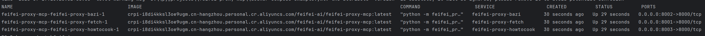
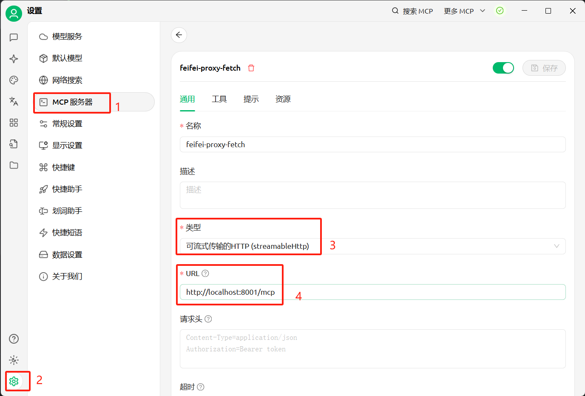
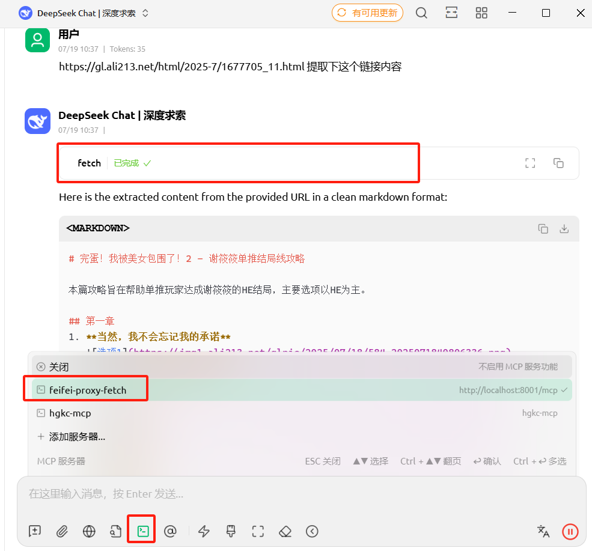

<div style="text-align: center;">
    
    <h1> MCP 传输类型转换服务 </h1>
</div>

<hr/>

> 可以将现有的MCP类型为 stdio / sse 转换为 streamable_http传输类型的MCP
> 
> 本实现完全按照标准的MCP官方进行实现
> 
> 版本更新：
> 
> 当前版本： 0.0.1

## 快速开始

### 本地部署（如果无需本地部署调试，请跳过，直接到容器化部署）
> python环境要求：python 3.12
> 
> 未安装uv 请按照以下步骤安装， 已安装请忽略
> 
> uv 官网 https://docs.astral.sh/

#### macos / linux uv安装
```shell
curl -LsSf https://astral.sh/uv/install.sh | sh
```
#### windows uv安装
```shell
powershell -ExecutionPolicy ByPass -c "irm https://astral.sh/uv/install.ps1 | iex"
```

<hr/>

## 环境变量信息

| 参数                        | 描述            | 默认值                | 是否必填 | 备注                                           |
|---------------------------|---------------|--------------------|------|----------------------------------------------|
| `TRANSPORT_TYPE`          | 传输协议类型        | `streamable_http`  | 否    | 填写传输协议类型，可选值：`stdio`、`sse`、`streamable_http` |
| `PROXY_MCP_NAME`          | 代理的 MCP 服务器名称 | `feifei-proxy-mcp` | 否    | 代理的mcp服务名称                                   |
| `PROXY_MCP_SERVER_CONFIG` | mcp 服务器配置           | -                  | 是    | 要代理的mcp服务配置                                  |
| `PROXY_MCP_PORT`          | 服务端口          | `8000`             | 否    | 代理mcp协议类型为 `sse` 或 `streamable_http` 时使用     |

<hr/>

## 容器化部署
> 使用前 请保障当前机器已安装 docker 环境


### docker 命令行部署

> 以下以部署 fetch mcp 为例，将stdio转为 streamable_http mcp

```shell
docker run -e PROXY_MCP_SERVER_CONFIG='{"mcpServers":{"fetch":{"command":"uvx","args": ["mcp-server-fetch"]}}}'  
  crpi-i8di4kksl3oe9ugm.cn-hangzhou.personal.cr.aliyuncs.com/feifei-ai/feifei-proxy-mcp:latest
```

### docker-compose 部署 （推荐使用此方式来实现快速部署）
> 使用docker-compose 也可以同时部署多个代理mcp
> 
> 比如以下示例 我通过docker-compose 部署了3个代理mcp
> 
> feifei-proxy-fetch => 网页内容爬取 streamable_http mcp
> 
> feifei-proxy-bazi => 出生八字分析 streamable_http mcp
> 
> feifei-proxy-howtocook => 食谱分析 streamable_http mcp

```yml
# docker-compose.yml
version: '3.8'
services:
  feifei-proxy-fetch:
    image: 'crpi-i8di4kksl3oe9ugm.cn-hangzhou.personal.cr.aliyuncs.com/feifei-ai/feifei-proxy-mcp:latest'
    ports:
      - "8001:8000"
    environment:
      PROXY_MCP_SERVER_CONFIG: '{"mcpServers":{"fetch":{"command":"uvx","args": ["mcp-server-fetch"]}}}'

  feifei-proxy-bazi:
    image: 'crpi-i8di4kksl3oe9ugm.cn-hangzhou.personal.cr.aliyuncs.com/feifei-ai/feifei-proxy-mcp:latest'
    ports:
      - "8002:8000"
    environment:
      PROXY_MCP_SERVER_CONFIG: '{"mcpServers":{"Bazi":{"command":"npx","args":["bazi-mcp"]}}}'

  feifei-proxy-howtocook:
    image: 'crpi-i8di4kksl3oe9ugm.cn-hangzhou.personal.cr.aliyuncs.com/feifei-ai/feifei-proxy-mcp:latest'
    ports:
      - "8003:8000"
    environment:
      PROXY_MCP_SERVER_CONFIG: '{"mcpServers":{"howtocook-mcp":{"command":"npx","args":["-y","howtocook-mcp"]}}}'
```

docker-compose.yml配置完成后，执行部署命令以完成mcp服务启动
```shell
# 启动
docker compose up -d

# 部署成功后 通过
docker compose ps 来查看容器启动状态
```



<hr/>

## 客户端接入
> 这里以 [cherry stdio](https://www.cherry-ai.com/) 作为接入示例
> 如果未安装，也可自行安装，或者在自己的cline, cursor中添加mcp server 完成使用





